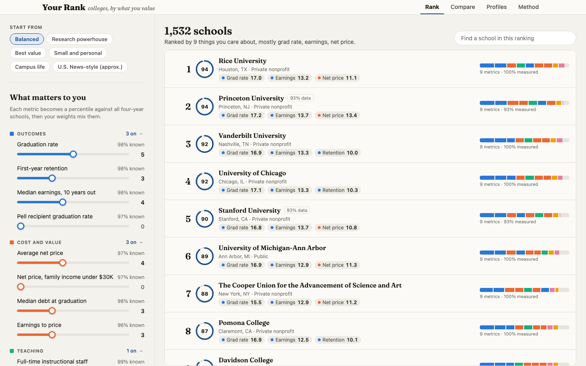
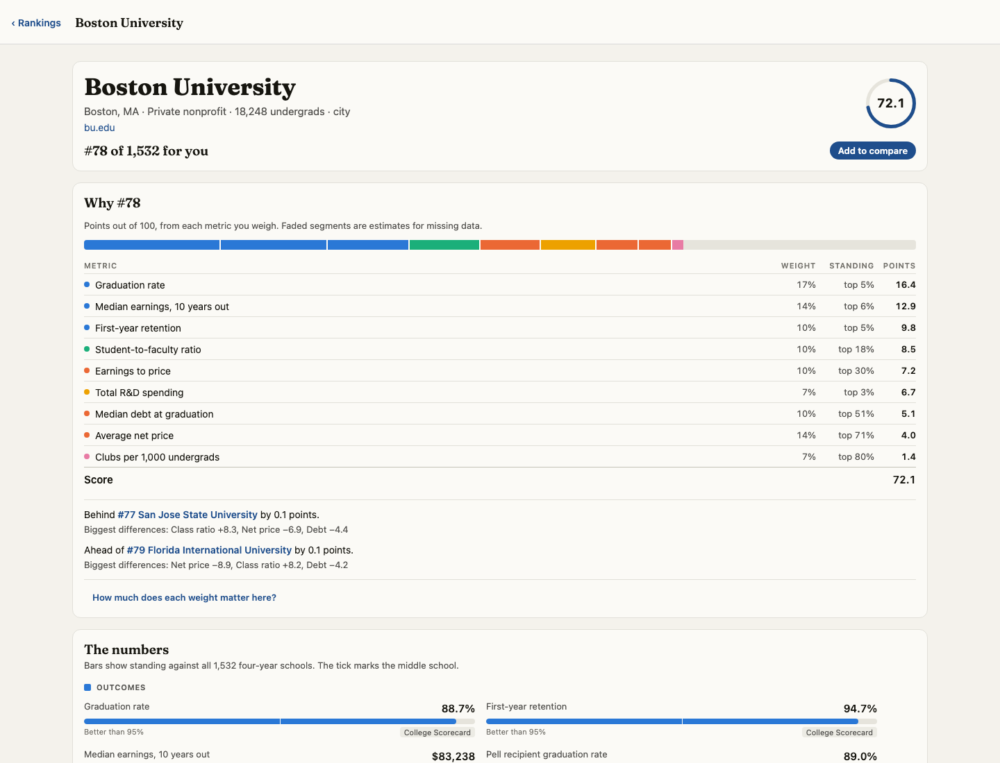
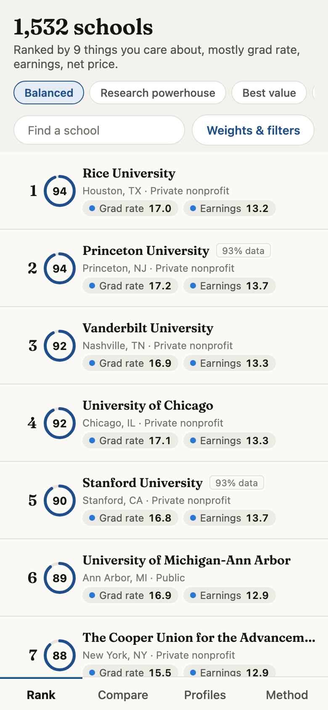
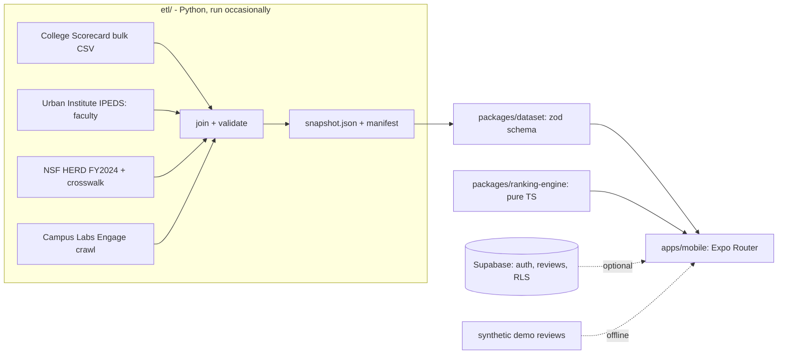

# College Rankings

Rank four-year colleges using your own priorities. Set weights for graduation rates, cost,
class size, research, clubs and student reviews. The app ranks 1,532 U.S. colleges as you adjust
them and shows how it scored each school.

One Expo codebase runs on iOS, Android and the web. Ranking happens on the device using a versioned
snapshot of public data, so the app works offline. An optional Supabase backend adds
reviews from students who verify a school email.



| School page | Phone |
|---|---|
|  |  |

Planned Pages URL: `https://krishmdev.github.io/college-rankings/`. This is not a verified live
deployment. Run the public, no-key web demo locally with the commands below; see [Deploy](#deploy)
for the optional publishing path.

## Quickstart (offline)

Requires Node 22, pnpm 10, and (for the ETL only) uv with Python 3.13.

```bash
make setup          # pnpm install, Playwright's Chromium, uv sync (network)
make demo           # static web build served at http://127.0.0.1:4173/college-rankings/
make test           # engine + dataset contract (vitest), ETL (pytest)
OFFLINE_WRAPPER="$PWD/scripts/offline-run" make e2e-offline  # macOS: Playwright with outbound network denied
```

`make e2e-offline` and `make canary` need `OFFLINE_WRAPPER` set to a command that denies outbound
network for a whole process tree. The bundled `scripts/offline-run` is a macOS sandbox-exec profile
that denies outbound network except localhost (and Unix sockets), and it clears Supabase
environment variables. Use its absolute path, because the Playwright target changes directory.
`make demo` uses the wrapper too when it's set. The bench and Supabase scripts accept an optional
`RUN_WRAPPER` command prefix for running exclusively on the machine; both are empty by default.

`pnpm web` starts the Expo dev server instead. `pnpm start` gives a QR code for Expo Go on a
phone; SDK 57's Expo Go needs the same Expo account signed in on the CLI and in the app.

No API keys are needed for anything above. The dataset is committed in `packages/dataset/data/`.

## How it works



### The ranking

Every metric becomes a mid-rank percentile across the schools that report it,
`p = (below + ½·tied) / reporting`. For "lower is better" metrics (net price, debt, class ratio) it's
`1 − p`. The score is `100 · Σ wᵢ sᵢ / Σ wᵢ`, summed in a fixed metric order, so only the ratios
between weights matter. Each metric's contribution `100·wᵢsᵢ/Σw` is shown on the school page, and the
contributions add up to the score. Ties break on score (to 1e-9), then data coverage, then name, then
id, so a profile always produces the same order no matter how the input is sorted.

Why percentiles instead of raw values or z-scores? Research spending across the 1,491 schools with a
value has a median of $373K, a mean of $72.8M, a standard deviation of $269.3M and a maximum of
$4.13B (Johns Hopkins). Min-max scaling would put 91.4% of schools below 0.05 and only 3 above 0.5.
As z-scores, Boston University is +2.64 and the median school −0.27, so one heavy-tailed metric would
swamp the others. As a percentile BU is 0.971, and every slider works on the same even 0-1 spread.
The cost is that magnitude is lost ($2B vs. $1B is just a rank difference) and results depend on the
universe, which the fixed, versioned snapshot keeps reproducible.
(Numbers from [`docs/results/report.md`](docs/results/report.md), generated by `pnpm engine:report`.)

### Missing data

Schools report different sets of metrics. You can handle gaps in three ways:

- **Penalize** (default): a missing metric counts as the 25th percentile. That assumes "below
  average", not "worst": a school that would land in the bottom quarter on that metric can come out
  ahead by not reporting it. The "only schools with data for every metric I weigh" filter removes
  non-reporters instead.
- **Neutral**: a missing metric counts as the 50th percentile.
- **Use what is known**: a missing metric is filled with the school's own average on its known
  metrics, pulled toward the middle by how much of the profile is missing:
  `fill = c·raw + (1 − c)·0.5`, so `score = (1 − (1 − c)²)·raw + (1 − c)²·0.5`, where `c` is the
  share of weight that has data.

The design doc originally shrank the whole score, `score = c·raw + (1 − c)·0.5`. That turns out to
be the neutral strategy in disguise: `c·raw = Σ_known w·s / Σw` and `(1 − c)·0.5 = Σ_missing w·0.5 / Σw`.
Shrinking the fill value instead is what makes the third option different. A unit test checks that
it doesn't equal neutral.

The choice matters when coverage is thin. Club counts cover 19.4% of schools. With the Campus life
preset, penalize and neutral agree on 50 of the top 50, and "use what is known" shares 43 of them.

### Explanations

The school page shows the "why #N" breakdown, the gap to the schools directly above and below
(split by metric), and, on request, where the school would land if you dropped or doubled each
weight. Student reviews use a Bayesian average, `(n·mean + 5·μ) / (n + 5)`. A school with fewer than
3 reviews counts as missing on that dimension.

### Speed

`pnpm engine:bench` ran exclusively on the machine and writes
[`docs/results/engine-bench.json`](docs/results/engine-bench.json) with a host manifest. Timings are
in Node with a warm index. Ranking 2,500 synthetic schools with all 28 metrics weighted takes 1.12 ms
at the median (the target was under 5 ms). The real 1,532-school snapshot with the Balanced preset
takes 0.44 ms. The worst case is the first ranking after a filter change with "compare within these",
which rebuilds percentiles: 15.3 ms. The per-school sensitivity table re-scores every school twice
per weight, about 23.7 ms, so the school page computes it only when you ask.

## Compared with U.S. News

U.S. News uses one editor-chosen weighting for everyone. About a fifth of it is a peer reputation
survey. The "U.S. News-style (approx.)" preset copies their National Universities weights wherever
public data exists: graduation 16, retention 5, social mobility 11 (Pell graduation rate stands in),
borrower debt 5, earnings 5, financial resources 8 (instructional spend per student), faculty
salary 6, student-faculty ratio 3, full-time faculty 2, SAT/ACT 5, bibliometrics 4 (total R&D stands
in). That covers 70 of their 100 points. The peer survey (20) and graduation-rate performance (10)
can't be reproduced.

These are the weights U.S. News has used since its 2024 edition, which it says the 2026 edition kept.
usnews.com timed out or refused automated requests while this was built, so they come from secondary
summaries. **Check them against the U.S. News methodology page before quoting them.**

Small weight changes can move schools far. Here is the preset's top 10, and each school's rank after one
change (from [`docs/results/report.md`](docs/results/report.md)):

| School | Rank | no grad rate | no SAT | no research | add net price (w=5) |
|---|---|---|---|---|---|
| Massachusetts Institute of Technology | 1 | 1 | 2 | 2 | 8 |
| Princeton University | 2 | 2 | 1 | 1 | 1 |
| Duke University | 3 | 3 | 3 | 3 | 19 |
| Harvard University | 4 | 6 | 4 | 4 | 7 |
| Johns Hopkins University | 5 | 4 | 5 | 5 | 6 |
| Yale University | 6 | 7 | 6 | 7 | 15 |
| Stanford University | 7 | 5 | 7 | 8 | 2 |
| Brown University | 8 | 8 | 8 | 6 | 17 |
| University of Chicago | 9 | 9 | 10 | 9 | 4 |
| University of Pennsylvania | 10 | 11 | 9 | 11 | 23 |

The largest single move in the top 50 is Georgetown, #29 to #67, when net price gets a weight of 5.

## Data

Snapshot `2025-12-23` covers 1,532 schools: currently operating, predominantly bachelor's-granting,
public or private nonprofit, four-year, not online-only, with at least 300 undergraduates. Every
metric carries its source and any caveat into the app as a provenance badge.

| Source | What it gives | Coverage |
|---|---|---|
| [College Scorecard](https://collegescorecard.ed.gov/data/) bulk CSV (June 2026 release) | outcomes, cost, SAT, admit rate, class ratio, spending, faculty salary | 64-100% by metric |
| [Urban Institute Education Data Portal](https://educationdata.urban.org/) (IPEDS) | full-time instructional staff ("number of teachers") | 99.0% |
| [NSF HERD FY2024](https://ncses.nsf.gov/surveys/higher-education-research-development/2024) | total R&D spending | 97.3% |
| [Campus Labs Engage](https://www.campuslabs.com/campus-engagement/) public directories | number of student organizations | 19.4% |

Per-metric coverage is in [`data/snapshots/2025-12-23/coverage.md`](data/snapshots/2025-12-23/coverage.md),
and file hashes and retrieval dates are in the manifest next to it.

The ETL accounts for several source-data quirks:

- **HERD rows without a unitid.** 32 standard-form rows have no IPEDS id, including Johns Hopkins
  (the largest R&D spender), Ohio State and Maryland. A plain join gives them $0.
  - 23 of them are mapped to a school in
    [`herd_unitid_overrides.csv`](etl/crosswalks/herd_unitid_overrides.csv) by hand-reviewed fuzzy
    match. The file also maps 3 short-form rows.
  - The other 9 are research institutes or graduate-only units, so they're excluded.
  - [`herd_exclusions.csv`](etl/crosswalks/herd_exclusions.csv) lists every excluded HERD unit, 46
    in all, each with a reason. Most are medical schools and research institutes.
  - The build fails if any HERD row of $10M or more is left unaccounted for.
- **Joint HERD reporting.** HERD reports some universities together with their medical center or
  branch campuses. The 41 campuses inside a parent's figure (UMD Baltimore, UNMC, OU Health Sciences,
  Penn State and UConn branches, ...) are marked "counted with <parent>", not $0. The parent's
  per-student figure divides by the combined enrollment. The build also fails on any school given
  $0 that shares a federal OPEID with a HERD school, or has 250+ faculty, unless it's reviewed in
  [`herd_reviewed_absent.csv`](etl/crosswalks/herd_reviewed_absent.csv).
- **Not in HERD is not $0.** HERD only surveys schools with at least $150K of R&D. The 683 schools
  absent from it rank as the lowest research tier and display as "under $150K", never "$0".
- **Club counts.** Many schools host their club directory at `<sub>.campuslabs.com/engage`, and the
  public search API returns a count. The crawler tries one subdomain per school (the first label of
  its web domain), at most 2 requests per second, stores only counts, and records every result in
  [`engage_subdomains.csv`](etl/crosswalks/engage_subdomains.csv) so reruns resume. 305 of 1,496
  candidates were found. Subdomains of 3 characters or fewer were checked by hand against the site
  title. Two ambiguous ones were rejected, and two shared ones were resolved in
  [`clubs_manual.csv`](etl/crosswalks/clubs_manual.csv). Everyone else shows "unknown".

Rebuilding the snapshot (about 32 MB of downloads the first time):

```bash
cd etl && uv run college-etl build --snapshot-id $(date +%F)   # fetch, join, validate, emit, publish
uv run college-etl engage-discover                              # resumable club crawl, ~15 min
uv run college-etl seed-sql                                     # regenerate supabase/seed.sql
```

The output is deterministic: sorted keys, 6 significant figures, and a content hash that ignores
the timestamp. The zod schema in `packages/dataset` and the pydantic mirror in the ETL are both
checked against the committed file in tests.

Attribution: College Scorecard and NSF HERD are U.S. government works (public domain). Faculty
counts come from the Urban Institute's Education Data Portal. Club counts come from each school's
public Engage directory.

## Student reviews (optional backend)

Student reviews require an account verified through a school email address.

- **Accounts are school-email-only, for their whole life.**
  - A `before_user_created` auth hook refuses any signup whose domain isn't mapped to a school.
    Subdomains match their parent, so `cs.bu.edu` counts as `bu.edu`.
  - Email changes to an unmapped domain are refused when they're requested: a trigger on
    `auth.users.email_change` raises before GoTrue stores the pending address. A second trigger on
    `auth.users.email` is the backstop for any other write path.
  - The sign-in screen calls an `is_school_email` RPC before asking for a code. The app has no
    email-change screen; a client calling `updateUser({ email })` directly should run the same
    precheck. GoTrue sends the confirmation email before it writes to the database, so without the
    check a non-school address would get a code that can never work.
    Anonymous rate limiting of that RPC is left to Supabase's gateway defaults.
  - One account per mailbox. The address is lowercased and anything after a `+` is dropped, and
    that normalized form is unique across accounts, so `alice+2@bu.edu` can't open a second
    account next to `alice@bu.edu`. Subdomain addresses are not merged: `alice@cs.bu.edu` and
    `alice@bu.edu` count as separate mailboxes, even when they deliver to the same inbox.
- **Affiliations are server-owned.** `school_affiliations` is written only by `security definer`
  triggers. It starts as `pending` and becomes `active` when the email is confirmed. A confirmed move
  to another school's email revokes the old affiliation, activates the new one, and sends the user's
  old reviews back to moderation. Email changes need confirmation from both the old and the new
  address.
  - Removing a domain from `school_domains` later does not revoke anyone. Admins revoke explicitly
    with `admin_revoke_affiliation`. That revoke is about the person, not the address: a later email
    change doesn't grant a new affiliation.
- **RLS trusts only `status = 'active'`.**
  - A review insert or edit requires an active affiliation with that school.
  - Users have no write privileges on affiliations or roles.
  - Column grants keep `status` out of reach.
  - Every insert and edit is re-moderated by a trigger: emails, phone numbers, links and a short
    banned-term list send a review to the moderator queue. The limit is 5 reviews per day.
  - An edit can clear an automatic flag, but not a flag from reporters, a moderator's decision, or
    a hold after an affiliation change. No edit changes those, including one that trips and then
    clears the automatic filter; pgTAP covers that two-step case.
  - Authors withdraw a review instead of deleting it. Deleting would drop its reports and let the
    author post a fresh copy. Withdrawing (`withdraw_review`) and reporting (`review_reports`) are
    API-level only: the app has no buttons for them yet.
  - Three reports from three different accounts (one per mailbox) flag a review. Reports on one
    review are serialized with a row lock. The integration test fires three reporters' requests at
    once, on separate sessions, and checks that all succeed and the review ends up flagged.
  - Anonymous readers see reviews through a `public_reviews` view with no author ids.
- Aggregates come from a view over published reviews. The app merges them into the engine as the
  seven "Student reviews" metrics.

Without a backend (the default and the Pages build), the app uses 737 **synthetic** reviews for 100
schools, generated by `apps/mobile/scripts/make-demo-reviews.mjs`. They're labeled "Synthetic demo
data" wherever they appear: on the review card, in the Student reviews sliders, and in chips and
the "why #N" table. With a backend configured, the app never falls back to them; if the server is
unreachable, the crowd metrics are empty and the sliders say so.

School-email verification can't distinguish students from faculty, staff or alumni with a school
address, including `alum.`/`alumni.` subdomains, which match their school's domain.

To run it locally:

```bash
pnpm supabase:test   # starts a trimmed local stack, db reset, pgTAP, auth integration test, stop
npx supabase start -x realtime,storage-api,imgproxy,postgres-meta,studio,edge-runtime,logflare,vector,supavisor
EXPO_PUBLIC_SUPABASE_URL=http://127.0.0.1:54321 EXPO_PUBLIC_SUPABASE_KEY=<anon key from `npx supabase status`> pnpm web
open http://127.0.0.1:54324   # Mailpit: sign-in codes land here
```

## Testing

- `pnpm test`: 55 vitest tests.
  - Engine: hand-computed values for all three missing-data strategies, and fast-check properties
    for determinism under shuffling, weight-scale invariance, monotonicity, dominance, contributions
    summing to the score, and the share-link codec round trip.
  - Dataset: a contract test against the committed snapshot.
- `cd etl && uv run pytest`: sentinels, universe filter, HERD crosswalk and gates, joint-row
  members, Engage crawl (mocked with respx, including resume and rate limiting), deterministic emit,
  committed-snapshot hash, seed generation.
- `make e2e-offline`: Playwright on desktop and phone viewports against the static export under the
  `/college-rankings` subpath.
  - The whole process tree runs under `$OFFLINE_WRAPPER`, which denies outbound network.
  - An egress canary inside the preview server must fail to reach 1.1.1.1 and friends.
  - `make canary` shows the same canary connecting when unsandboxed.
  - In CI the same suite runs in a `--network none` container.
- `pnpm supabase:test`: pgTAP for the affiliation lifecycle, email policy, RLS, moderation and
  reports, plus a Node integration test against the local Auth API and Mailpit. Results are in
  [`docs/verification.md`](docs/verification.md).

## Deploy

`.github/workflows/deploy-web.yml` builds `expo export -p web` with `WEB_BASE_URL=/college-rankings`,
copies `index.html` to `404.html` so deep links work on GitHub Pages, and deploys with
`actions/deploy-pages`. Pages has to be turned on once (Settings > Pages > GitHub Actions), and on a
free plan the repo must be public. The Pages build has no backend, so it shows the synthetic reviews.

## Limitations

- **Native not run on a device.** There's no Xcode on the machine this was built on, and no device
  or emulator was used. The web build and the Playwright suite are what's verified. The native
  JavaScript bundle does build (`npx expo export -p android` produces the Hermes bundle), but
  nothing native was exercised: sliders, the filter sheet, AsyncStorage.
- **Public-data averages.** Every figure is school-wide: nothing about your major, your aid
  package, or fit.
- **Club counts are partial.** Coverage is 19.4%, and schools on other platforms show as unknown.
  Engage's terms don't address automated counting. The crawl is slow, stores only counts, and can be
  replaced by the manual CSV.
- **U.S. News weights are unverified** against the primary page (see above), and 30 of their 100
  points can't be reproduced.
- **Percentiles lose magnitude** and depend on the universe; the snapshot is versioned to keep
  results stable.
- **Hosted Supabase** only sends auth email to project members (2 per hour) without custom SMTP,
  so public signups on a hosted project need an SMTP provider. The local stack captures mail in
  Mailpit.
- **School email is not student status.** Faculty, staff and alumni with a school address, including
  `alum.`/`alumni.` subdomains, can review too. One account per mailbox doesn't stop someone who
  has two real mailboxes, and subdomain forms of an address (`alice@cs.bu.edu` vs `alice@bu.edu`)
  count as separate mailboxes.

## Layout

```
apps/mobile           Expo SDK 57 app (Expo Router, react-native-web), e2e/ Playwright specs
packages/ranking-engine  pure TypeScript ranking: percentiles, scoring, explain, codec, presets
packages/dataset      snapshot.json, manifest, generated report, zod schema + contract test
etl/                  Python 3.13 ETL (uv, polars): sources, crosswalks, validation, emit
supabase/             migrations, seed.sql (generated), pgTAP tests, auth integration test
docs/                 results (bench, report), screenshots, verification log
```

## License

MIT. See [LICENSE](LICENSE).
